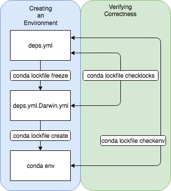

conda_lockfile
==============

`conda_lockfile` manages the life cycle of a production application's conda
environment.

The intention is to allow developers to manage their requirements at a
relatively high level, while also being able to freeze these requirements &
ensuring that the same environment always gets created.  This is heavily
influenced by [Cargo](https://doc.rust-lang.org/cargo/)'s `Cargo.toml` and
`Cargo.lock` workflow, and in spirit with
[poetry](https://github.com/sdispater/poetry).

The expected workflow is (blue):

1. Define a `deps.yml` file.
1. Freeze (`conda lockfile freeze`) these requirements into a
   `deps.yml.{platform}.lock` file.
1. Create (`conda lockfile create`) an environment from the lockfile.

It is the nature of dependencies to evolve, so there are commands for verifying
that your dependencies are in sync with your lockfiles and created
environments (green).

1. The depsfile and lockfile are in sync (`conda lockfile checklocks`).
1. The depsfile and created environment are in sync (`conda lockfile checkenv`).

When dependencies change, `deps.yml` should be updated and the lock files
re-generated.

`deps.yml`
-----------------------
The cycle starts with a deps.yml file (a conda environment file) that specifies
the application environment's dependencies.  This should be as loose as
possible and only specified the packages and versions that you specifically
want to manage.  The standard name for this file is `deps.yml`

`conda lockfile freeze`
-----------------------
From this high level description of dependencies, `conda_lockfile` will
generate a detailed, comprehensive list of dependencies.  ie a lockfile.  This
file is immune to dependencies publishing updated versions.  So long as your
project uses this lockfile the environment will be exactly the same.  The
standard name for this file is `deps.yml.{platform}.lock.  This file will generally be
checked into source control.

`conda lockfile create`
-----------------------
From the lockfile, `conda_lockfile` can create an environment. This is a
thin wrapper around `conda env create` plus some additional metadata
to verify the provenance of the lockfile/environment.

`conda lockfile checkenv`
----------------------
Verifies that `deps.yml` and installed environment "match".  It does this by
embedding a hash of `deps.yml` and stashing that within the environment created
from `deps.yml.{platform}.lock`.  This is primarily useful for development & quickly
detecting changes to `deps.yml` that invalidate the existing environment.

`conda lockfile checklocks`
---------------------------
Verifies that your lockfiles deps.yml.{Linux|Darwin}.lock are in sync with
your `deps.yml` files.
